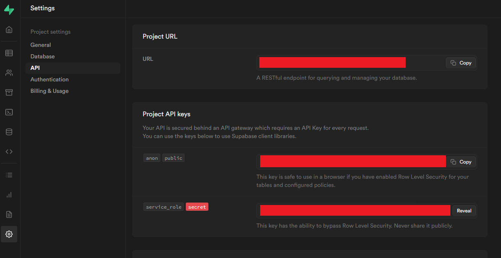
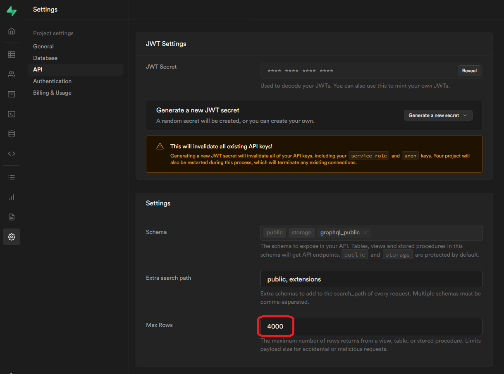

# Supabase-googlesheet
In this repo, you will see how to pull datas from your supabase project using **Supabase API**.

# The code
You can get it [here](src/code.gs).

# Prerequisites
This project assumes that you are already familiar to supabase and google appscript.   

You will need :
- the URL of your supabase project
- its API KEY (service role or anon one, depending your RLS)

- and of course : your google account.

And that's it !

# How often can I refresh datas ?
- Every minute
- Every hour
- Every day
- At a specific date
- On a special event (event-driven triggers)
 
More informations about google script triggers [here](https://developers.google.com/apps-script/guides/triggers/installable).

**CAUTION** : be careful of your daily quotas on your google account. For a free account, you can have 90 minutes of trigger runtime per day (**July 2022**). Feel free to see google triggers quotas [here](https://developers.google.com/apps-script/guides/services/quotas).

# Motivation
Google Scripts can't handle postsgresql connections yet, so here is a workaround to pull datas everyday at the same hour. We don't really want a realtime update. Just a snapshot is enough.   

Once the datas are available on your Google Sheet, you can explore many possibilities, like using **Google Data Studio** that pulls datas from google sheets **[every 15 minutes](https://support.google.com/datastudio/answer/7020039?hl=en#zippy=%2Cin-this-article%2Cdata-refresh-rates-by-connector)**. 

# Possible limits
- Your [daily quota](https://developers.google.com/apps-script/guides/services/quotas) from your google account as stated before
- Your supabase max rows limit, which can be changed here :

**I highly recommand you to not set this parameter too high, or to create a strong [RLS](https://supabase.com/docs/guides/auth/row-level-security) to make sure your users don't over pull your datas.**

